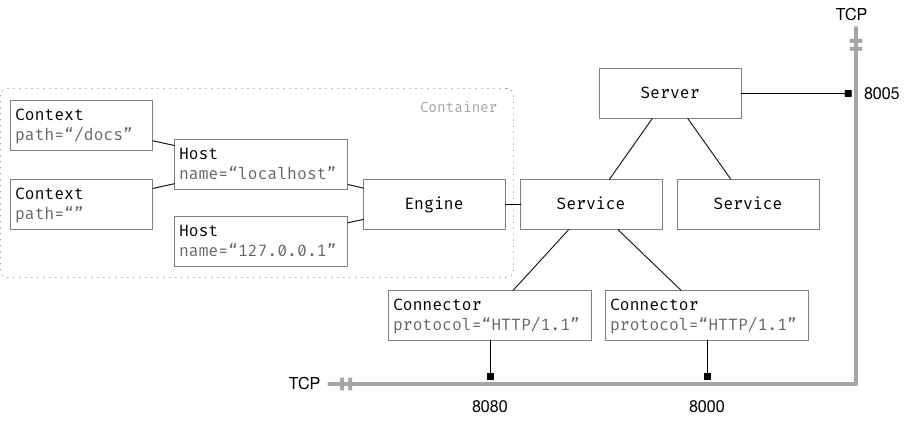
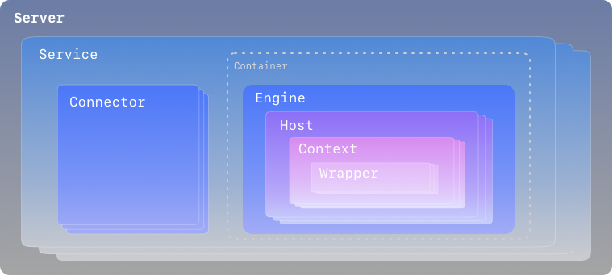
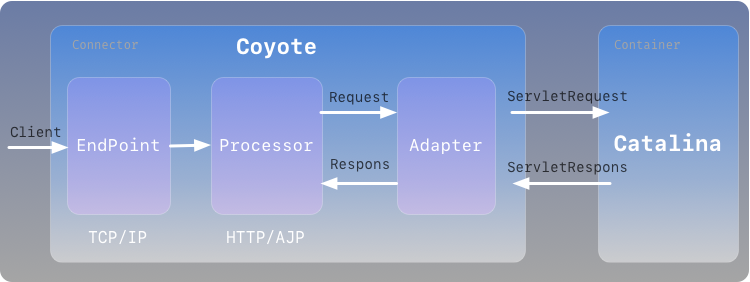
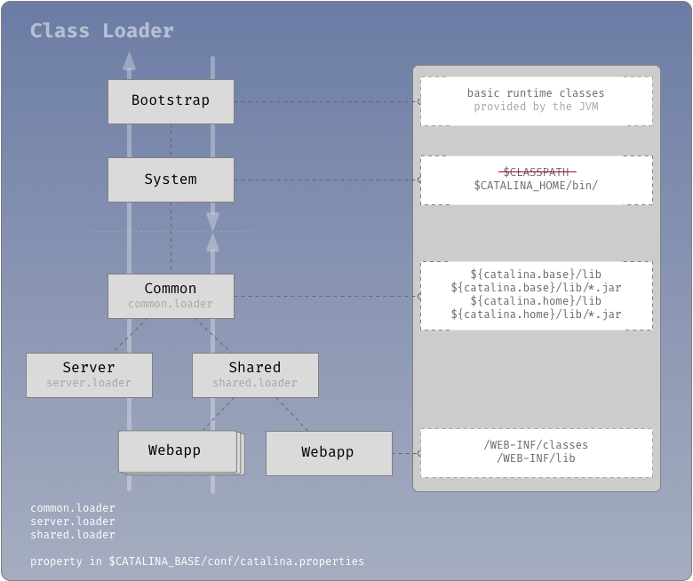

#### 编译 tomcat

```shell script
./ant
```

#### 定制 [`tomcat.sh`](tomcat.sh)

```shell script
#!/usr/bin/env bash

TOMCAT_HOME="$(pwd)/output/build"
WORK_PATH="$(pwd)/work"

###
export JAVA_OPTS="-Xms128m -Xmx1024m"
export CATALINA_HOME="$TOMCAT_HOME"
export CATALINA_BASE="$WORK_PATH"

###
if [ ! -d "$CATALINA_BASE" ]; then
  #
  mkdir -p "$CATALINA_BASE/logs" "$CATALINA_BASE/webapps/ROOT"
  cp -r "$CATALINA_HOME/conf" "$CATALINA_BASE"
  #
  echo "Welcome !" > "$CATALINA_BASE/webapps/ROOT/index.html"
fi

###
case $1 in
start)
  "$CATALINA_HOME/bin/catalina.sh" start
  echo 'start done !'
  ;;
stop)
  "$CATALINA_HOME/bin/catalina.sh" stop
  echo 'stop done !'
  ;;
restart)
  "$CATALINA_HOME/bin/catalina.sh" stop
  sleep 3s
  "$CATALINA_HOME/bin/catalina.sh" start
  echo 'restart done !'
  ;;
configtest)
  "$CATALINA_HOME/bin/catalina.sh" configtest
  ;;
version)
  "$CATALINA_HOME/bin/catalina.sh" version
  ;;
*)
  # "$CATALINA_HOME/bin/catalina.sh" "$@"
  ;;
esac

exit 0
```

#### 调试 tomcat

```text
Main class: org.apache.catalina.startup.Bootstrap

VM options: -Dcatalina.home=output/build
```

#### 处理 日志乱码

```text
VM options: -Duser.language=en -Duser.region=US -Dfile.encoding=UTF-8
```

#### 简配 `server.xml`

- 样例(1)

```xml
<?xml version="1.0" encoding="UTF-8"?>
<Server port="8005" shutdown="SHUTDOWN">

  <Service name="Catalina-1">
    <Connector port="8080" protocol="HTTP/1.1" connectionTimeout="20000" redirectPort="8443" />
    <Engine name="Catalina-1" defaultHost="localhost">
      <Host name="localhost"  appBase="webapps" unpackWARs="true" autoDeploy="true">
        <Context docBase="docs" path=""/>
      </Host>
    </Engine>
  </Service>

  <Service name="Catalina-2">
    <Connector port="8000" protocol="org.apache.coyote.http11.Http11Nio2Protocol" connectionTimeout="20000" redirectPort="8443" />
    <Engine name="Catalina-2" defaultHost="localhost">
      <Host name="localhost"  appBase="webapps" unpackWARs="true" autoDeploy="true">
        <Context docBase="examples" path=""/>
      </Host>
    </Engine>
  </Service>

</Server>
```

- 样例(2)

```xml
<?xml version="1.0" encoding="UTF-8"?>
<Server port="8005" shutdown="SHUTDOWN">

    <Service name="Catalina">
        <Connector port="8080" protocol="HTTP/1.1" connectionTimeout="20000" redirectPort="8443"/>
        <Connector port="8000" protocol="HTTP/1.1" connectionTimeout="20000" redirectPort="8443"/>

        <Engine name="Catalina" defaultHost="localhost">
            <Host name="localhost" appBase="webapps" unpackWARs="true" autoDeploy="true">
                <Context docBase="docs" path="/docs"/>
                <Context docBase="ROOT" path=""/>

                <Valve className="org.apache.catalina.valves.AccessLogValve" directory="logs"
                       prefix="localhost_access_log" suffix=".txt" pattern="%h %l %u %t &quot;%r&quot; %s %b"/>
            </Host>

            <Host name="127.0.0.1" appBase="webapps" unpackWARs="true" autoDeploy="true">
                <Valve className="org.apache.catalina.valves.AccessLogValve" directory="logs"
                       prefix="127.0.0.1_access_log" suffix=".txt" pattern="%h %l %u %t &quot;%r&quot; %s %b"/>
            </Host>
        </Engine>
    </Service>

</Server>
```

#### 结构



#### 层次



#### 连接



#### 装载


